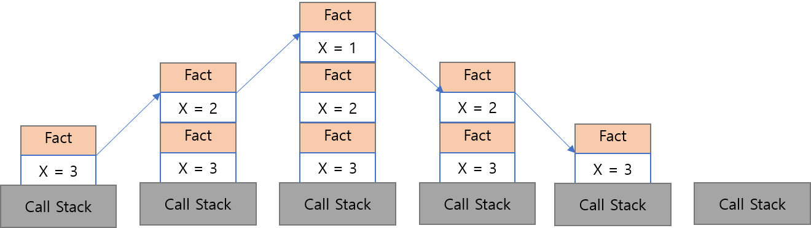

# 재귀

재귀는 가장 우아한 문제 해결 방법 중의 하나이다.
재귀란 함수가 자기 자신을 호출하는 것을 말한다.

-   레이 캐드웰 :
    프로그램에 반복문을 사용하면 프로그램의 성능을 향상 시킬 수 있지만,
    재귀를 사용하면 프로그래머의 능력을 향상시킬수 있다.

# 재귀 함수의 기본 단계, 재귀 단계

1. 기본 단계
   함수가 자기 자신을 다시 호출하지 않는 경우, 즉 무한 반복에 빠져들지 않게 하는 부분

2. 재귀 단계
   함수가 자기 자신을 호출하는 부분

# 재귀 함수 호출 스택

재귀 형태의 팩토리얼 함수를 통해 호출 스택이 어떻게 이루어 지는지 확인 해보자

-   팩토리얼 이란?

n 의 팩토리얼은 n!로 표시한다.
이는 1 부터 n 까지의 정수를 곱하는 연산이다.
즉 5! 이면 5*4*3*2*1 = 120 이다.

```javascript
function fact(x) {
    return x === 1 ? 1 : x * fact(x - 1);
}

fact(3);
```



위 이미지에서 볼 수 있듯이

함수는 fact(3) -> fact(2) -> fact(1) 순으로 stack 에 push 되고
fact(1) -> fact(2) -> fact(3) 순으로 stack 에서 pop 된다.

재귀 함수를 사용할 때는 메모리가 너무 커지기 때문에 이를 고려해야 한다.
