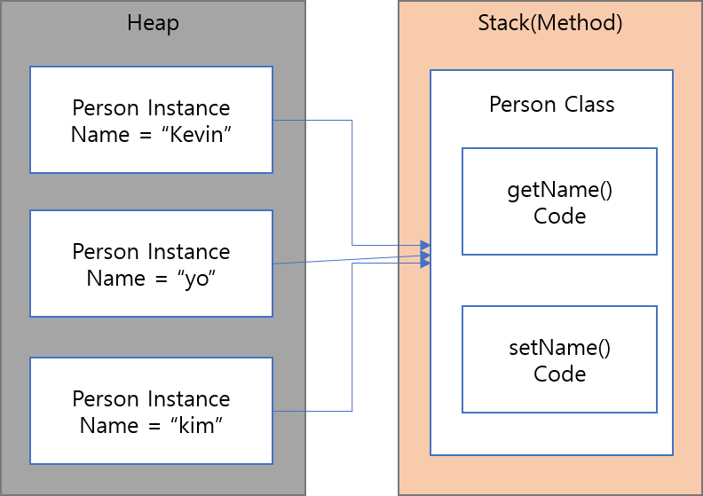

# 메모리 구조의 이해는 프로그래머의 소양

## 컴파일러와 인터프리터의 2 가지 실행 방식

프로그램의 실행 방식은 크게 나누어 컴파일러(Compiler) 방식과 인터프리터(Interpreter) 방식의 2 종류가 있다.

1. 컴파일 방식 :

컴파일러 방식에서는 프로그램에 쓰여 있는 명령을 그 자리에서 해석하고 실행 가능한 기계 언어로 변화환 후 실행 한다.

원시 코드 -> 일괄 변환 -> 기계 언어 -> 실행

-   장점 : 기계 언어를 직접 읽고 동작하기 때문에 프로그램 명령을 해석하는 여분의 동작이 필요 없어 실행속도가 빠름

-   단점 : 프로그램을 작성해도 바로 실행 할 수 없고, 먼저 컴파일을 해야할 필요가 있다. 컴파일에서 오류가 발생하면 컴파일이 안된다.

2. 인터프리터 방식 :

인터프리터 방시은 소스 코드에 쓰여 있는 프로그램의 명령을 그 자리에서 해석하고 실행 가능한 형식으로 축차 변환하면서 실행한다.

원시 코드 -> 해석 -> 기계 언어 -> 실행

-   장점 : 가볍게 실행시킬 수 있다. 전산환경에 맞게 해석하면서 각기 다른 플랫폼에서도 실행 가능하다.
-   단점 : 실행 속도가 느리다.

3. 중간 코드 방식

Java 와 C#같은 경우는 중간 코드 방식을 채용한다.

중간 코드 방식은 컴파일러를 사용해서 소스 코드를 특정 기계 언어에 의존하지 않는 중간 코드로 변환한다.

그리고 그 중간 코드를 전용의 인터프리터의 의해 해석하여 실행한다.

원시 코드 -> 중간 코드 -> 해석 -> 기계언어 -> 실행

## CPU 는 복수의 스레드를 가지고 실행한다.

스레드는 프로그램의 실행 단위라는 의미를 갖는 컴퓨터의 기본적인 용어이다.

컴퓨터의 심장부인 CPU 가 특정 시점에서 실행가능한 처리는 하나 뿐이다.
CPU 가 복수의 스레드 처리를 조금씩 순차적으로 처리하고,
그 속도가 워낙 빠르기 때문에 동시에 처리하는 것 처럼 보이는 것이다.

쓸데없이 기다리는 시간을 줄여서 전체 처리 효율을 높이는 방식이다.

단 복수의 CPU 를 탑제하면 cPU 의 수만큼 복수의 처리가 가능하다.

## 정적 영역, 힙 영역, 스택 영역으로 관리한다.

프로그램의 메모리 영역은 기본적으로 정적, 힙, 스택 영역으로 나누어져 있다.

| 종류          | 정역 영역                          | 힙 영역                                                        | 스택 영역                                  |
| ------------- | ---------------------------------- | -------------------------------------------------------------- | ------------------------------------------ |
| 사용법        | 어플리케이션이 시작할 때 확보된다. | 시작할 때 일정 영역이 확보되어 필요한 경우 어플리케이션에 할당 | LIFO                                       |
| 저장되는 정보 | 전역변수, 실행 코드                | 임의(어플리케이션에 따름)                                      | 호출한 서브루틴의 인수, 지역변수, 복귀위치 |
| 확보 단위     | 어플리케이션에서 모아서 1 개       | 시스템 또는 어플리케이션에서 1 개                              | 스레드마다 1 개                            |

## OOP 의 특징은 메모리 사용벙에 있다.

OOP 를 사용해서 작성된 프로그램의 메모리의 사용 방법이 이전과는 조금 다르다.

## 클래스 정보는 클래스마다 1 개만 로드된다.

클래스 정보를 로드하는 방식은 크게 나우어 2 가지 이다.

1. 사전에 모든 클래스 정보를 일괄해서 로드하는 방식 (C++)
2. 필요한 시점에 메모리에 축차적으로 로드하는 방식 (JAVA, C#)

2 번째 방식은 새로운 클래스를 읽을 때 오버헤드가 걸리지만,
실제로 동작하는 코드만큼만 메모리가 사용되기 떄문에 메모리 전체의 사용량을 줄일 수 있다.

또한 네트워크를 통한 분산되어 관리되는 프로그램 파일을 실행시에 결합해서 동작하는 것이 용이하게
되는 등 실행할 떄의 유연성도 확보할 수 있다.

Java 에서는 실행될 때 메모리의 배치가 변화한다고 해서 정적 영역이 아닌 메소드 영역이라고 부른다.

## 인스턴스를 만들 때 힙 영역에 사용된다.

인스턴스를 만드는 명령이 실행되면 이클래스의 인스턴스 변수를 저장하기 위해
필요한 만큼의 메모리가 힙 영역에 할당되고, 메소드 영역에 있는 클래스 정보의 관계 설정도 한다.

