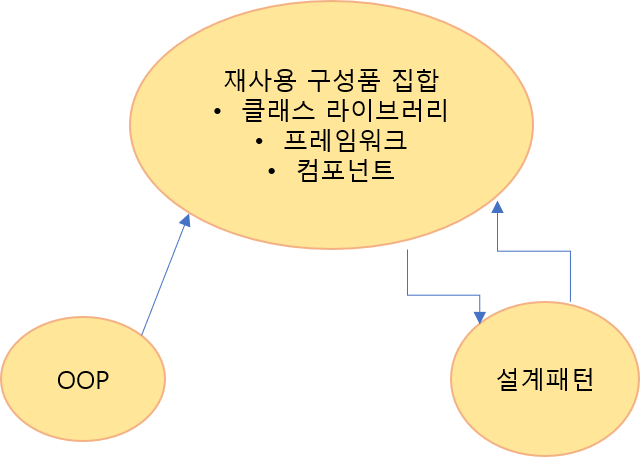
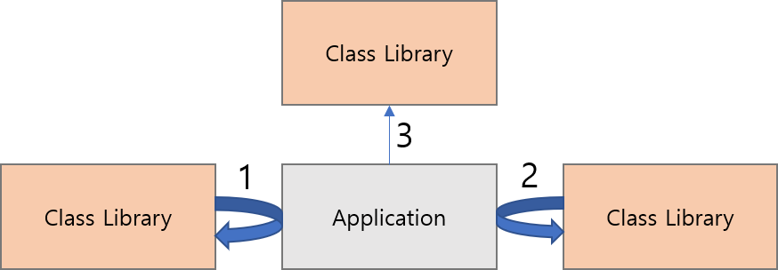

# OOP 가 가져다 준 소프트웨어와 아이디어의 재사용

-   소프트웨어 자체의 재사용 ( 라이브러리, 프레임워크, 컴포너트 등..)
-   설계 아이디어의 재사용 (설계 패턴)

프레임워크를 헐리우드 원칙이라고 표현을 하기도 한다.

헐리우드 원칙 : Don't call us, we will call you

즉 모든 제어의 흐름은 프레임워크에서 결정해 두고,
어플리케이션 처리는 폴리모피즘을 사용해서 필요할 때 호출하는 구조를 의미하고 있다.

## OOP 의 우수한 구조에 의해 재사용이 진행된다.

1. OOP 를 이용해서 재사용 구성 요소를 만들고
2. 재사용 구성 요소에 공통으로 나타나는 설계 아이디어를 추출한 설계 패턴이 등장
3. 재사용 구성 요소를 만들기 위해 설계 패턴을 이용

OOP 구조는 단지 프로그래밍 언어의 진화에 멈추지 않고
OOP 를 활용한 재사용 구성 요소의 발전과
OOP 를 활용하는 아이디어의 재사용이라는
2 가지 커다란 흐름을 낳는 기반이 되고 있다.

## 클래스 라이브러리는 OOP 의 소프트웨어 구성 요소 집합

클래스 라이브러리는 일반적인 기능을 갖는 클래스를 많이 모아 놓은것

클래스 라이브러리는 다음과 같은 기능을 제공한다 :

1. 라이브러리 중의 클래스로부터 인스턴스를 작성하고 메소드와 변수 정의를 모아서 이용한다. (클래스의 이용)
2. 라이브러리로부터 호출되는 쪽의 논리를 어플리케이션 고유의 처리로 바꾼다. (폴리모피즘 이용)
3. 라리브러리 중의 클래스에 메소드와 변수를 추가로 정의해서 새로운 클래스를 작성한다. (상속의 이용)

OOP 의 구조를 전제로 함에 따라, 재사용 가능한 기능의 범위가 비약적으로 넓어지게 된다.
