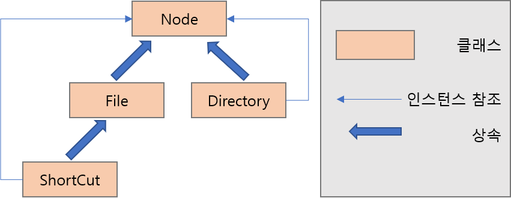
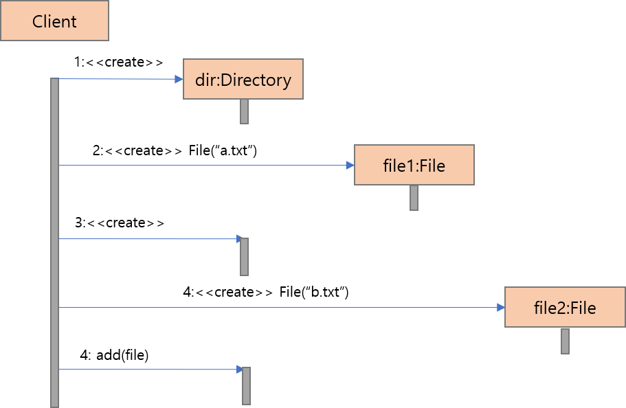
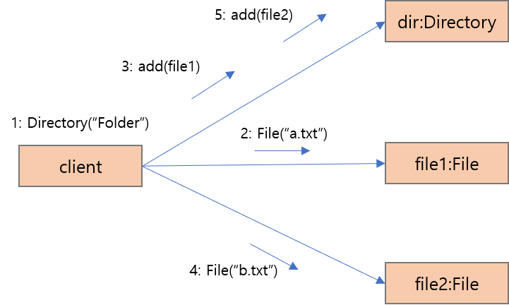
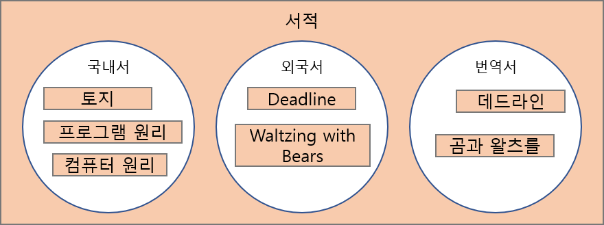

# UML 은 형태가 없는 소프트웨어를 보는 도구

## UML 은 소프트웨어의 기능과 구조를 나타내는 그림 그리는 법

UML 은 Unified Modeling Language 의 약자로 통합 모델링 언어이지만,
실체는 소프트웨어의 기능과 내부 구조를 표현하는 그림 그리는 방법이다.

## UML 에는 13 종류의 다이어 그램이 있다.

| NO  | 한글                       | 영어                         | 용도                                                                                      |
| --- | -------------------------- | ---------------------------- | ----------------------------------------------------------------------------------------- |
| 1   | 클래스 다이어그램          | Class Diagram                | 클래스 명세와 클래스 간의 관계를 표현                                                     |
| 2   | 복합 구조 다이어그램       | Composite Structure Diagram  | 전체-부분 구조를 가진 클래스를 실행할 때의 구조를 표현                                    |
| 3   | 컴포넌트 다이어그램        | Component Diagram            | 파일과 데이터베이스, 프로세스와 스레드 등의 소프트웨어 구조를 표현                        |
| 4   | 디플로이먼트 다이어그램    | Deployment Diagram           | 하드웨어와 네트워크 등 시스템의 물리 구조를 표현                                          |
| 5   | 객체 다이어그램            | Object Diagram               | 인스턴스 간의 연관 관계를 표현                                                            |
| 6   | 패키지 다이어그램          | Package Diagram              | 패키지 간의 연관 관례를 표현                                                              |
| 7   | 액티비티 다이어그램        | Activity Diagram             | 일련의 처리에 있어 제어의 흐름을 표현                                                     |
| 8   | 커뮤니케이션 다이어그램    | Communication Diagram        | 인스턴스 간의 상호 작용을 구조 중심으로 표현                                              |
| 9   | 시퀀스 오버뷰 다이어그램   | Sequence Diagram             | 인스턴스 간의 상호 작용을 시계열로 표현                                                   |
| 10  | 인터액션 오버뷰 다이어그램 | Interaction Overview Diagram | 조건에 따라 다르게 동작을 하는 시퀀스 다이어그램을 액티비티 다이어그램 안에 표함하여 표현 |
| 11  | 타이밍 다이어그램          | Timing Diagram               | 인스턴스 간의 상태 전이와 상호 작용을 시간 제약으로 표현                                  |
| 12  | 유스케이스 다이어그램      | UseCase Diagram              | 시스템이 제공하는 기능과 이용자의 관계를 표현                                             |
| 13  | 스테이트 머신 다이어그램   | State Machine Diagram        | 인스턴스의 상태 변화를 표현                                                               |

## UML 의 사용 방법은 크게 3 가지

1. OOP 프로그램의 구조와 동작을 표현한다.
2. 범용 정리술로 산출물을 표현
3. 객체 지향으로 표현할 수 없는 정보를 표현

## 프로그램 구조와 동작을 표현한다.

UML 은 프로그램을 2 차원의 그림으로 표현한다.

UML 에 정의되어 이쓴ㄴ 다이어그램중에서 프로그램의 구조와 동작을 표현하기 위래 사용되는 대표적인 것은
클래스 다이어그램, 시퀀스 다이어그램, 커뮤니케이션 다이어그램의 3 가지 이다.

## 클래스 다이어그램으로 OOP 의 프로그램 구조를 표현한다.

클래스 다이어그램은 클래스를 기본적인 단위로 하는 OOP 의 프로그램 구조를 표현한다.

직사각형은 클래스를 나타내고,
직사각형을 연결하는 선은 클래스 간의 관계를 나타낸다.

인스턴스의 참조와 상속 등의 차이는 화살표의 모양에 따라 표현합니다.



-   File, Directory 2 가지 클래스는 Node 클래스의 서브 클래스이다.
-   File 의 서브 클래스로서 ShortCut 클래스를 정의하고 있다.
-   ShortCut 클래스의 인스턴스는 Node 클래스의 인스턴스를 하나 가지고 있다.
-   Directory 클래스의 인스턴스는 Node 클래스의 인스턴스를 여러개 가지고 있다.

```java
//Node Class
public abstract class Node{
    private String name;
    protected Node(String name){
        this.name = name;
    }
    public String getName(){
        return this.name;
    }
    public void setName(name){
        this.name = name;
    }
}
//File Class
public class File extends Node{
    public File(String name){
        super(name);
    }
}
//ShortCut Class
public class ShortCut extends File{
    private Node linkedNode;
    public ShortCut(Node node, String name){
        super(name);
        this.linkedNode = node;
    }
    public ShortCut(Node node){
        super("Short Cut to " + node.getName());
    }
    public Node getLinkedNode(){
        return this.linkedNode;
    }
}
// Directory Class
public class Directory extends Node{
    private List children;
    public Directory(String name){
        super(name);
        this.children = new ArrayList();
    }
    public void add(Node node){
        this.children.add(node);
    }
    public Iterator getChildren(){
        return this.children.iterator();
    }
}
```

## 시퀀스 다이어그램과 커뮤니케이션 다이어그램으로 동적인 정보를 표현한다.

시퀀스는 연속, 순서라는 의미를 갖는 단어로 메소드의 호출을 시계열로 표현하는 것이다.
OOP 에 있어서 메소드는 대상으로 하는 인스턴스를 지정해서 호출하기 때문에 인스턴스 간의 상호 작용으로서 표현한다.



세로 축은 시간의 경과를 표현하고,
직사각형에서는 인스턴스의 이름을 사용
가로축은 화살표는 메소드를 호출을 표시하고,
화살표 위에 메소드 이름을 쓰는 이유는 OOP 에서는 하나의 클래스에 복수의 메서드를 정의 할 수 있기 때문이다.

커뮤니케이션 다이어그램은 기본적으로 시퀀스 다이어 그램과 같은 정보를 표현하지만, 인스턴스의 관계를 중심으로 하는 표현이다.
그리고 이 다이어그램은 인스턴스의 메모리 안에서의 배치를 표현하는 것이라고도 할 수 있습니다.



이들 다이어그램은 프로그램 논리를 작성하기 전의 설계도와 검토용자료로, 또한 완성된 프로그래밍 설명 자료로 활용할 수 있다.

## 집합론으로 정리한 결과를 클래스 다이어그램으로 표현한다.

UML 의 클래스 다이어그램은 집합론의 사고방식을 사용해서 사물을 분류, 정리하기 위한 산출물로써 사용하는 것이 가능한다.

간단한 예로 서적을 전체 집합, 국내서, 번역서, 외국서를 부분 집합으로 나누는 경우로 벤다이어 그램으로 표현가능 하다.



이를 UML 의 클래스 ㄷ이어그램을 사용해서 표현하면

## 역활 분감은 시퀀스 다이어그램과 커뮤니케이션 다이어그램으로 표현한다.

## 유스케이스 다이어그램으로 컴퓨터에 맡겨지는 일을 표현한다.

## 일의 흐름을 액티비티 다이어그램으로 표현한다.

## 상태의 변화를 스테이트 머신 다이어그램으로 표현한다.

## 자연 언어와 컴퓨터용 언어의 결점을 보완해 주는 언어
